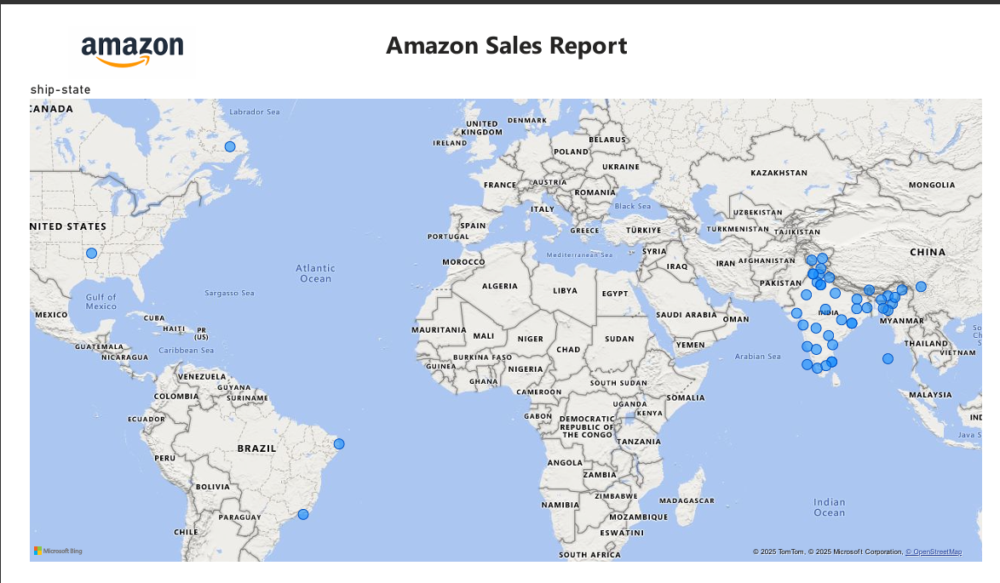
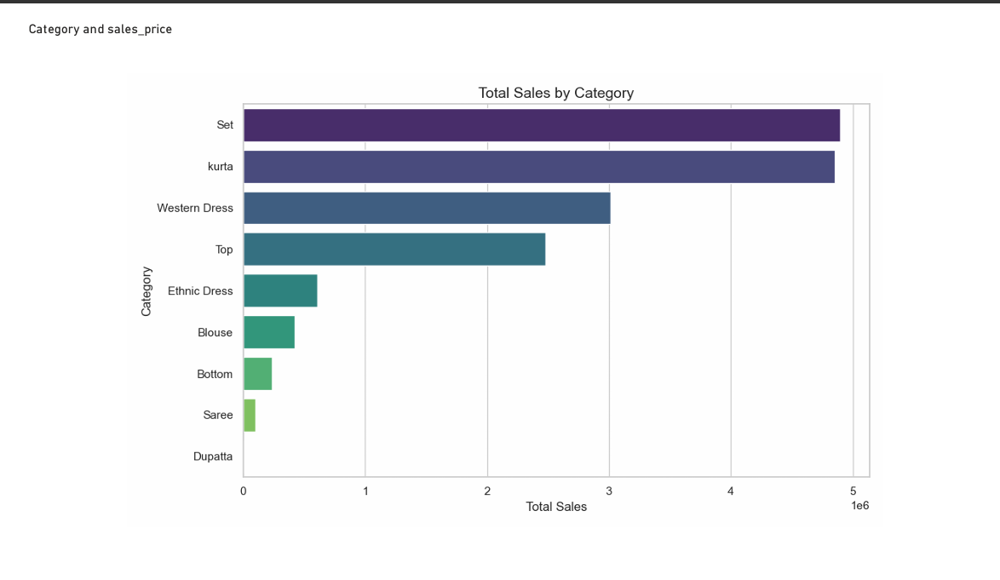

# 📊 Amazon Fashion Sales Dashboard - Power BI Project

This Power BI project analyzes Amazon fashion sales data across different dimensions such as category, location, time, and customer reviews. The goal is to derive actionable insights from historical sales trends to support strategic decision-making for fashion e-commerce.

## 🖼 Dashboard Preview

### Dashboard Overview

## 📁 Project Files

- `DW_Project.pbix` – The Power BI Desktop file with all data modeling, DAX measures, and visualizations.
- `DW_Project.pdf` – Exported dashboard views and summary report for quick reference.

## 🧾 Features

- **Sales Analysis by Category**
- **Location Insights**
- **Time Series Trends**
- **Customer Feedback**
- **Dynamic Filter Options**

## 📌 Key Measures (DAX)

- `Total Sales`
- `Total Orders`
- `Total Units`
- `Total Reviews`

## 🛠 Tools & Technologies

- **Power BI Desktop**
- **DAX (Data Analysis Expressions)**
- **Power Query**
- **Bing Maps for Geographic Analysis**

## ✅ How to Use

1. Open the `.pbix` file in Power BI Desktop.
2. Use slicers and filters to explore the dashboard.
3. Export insights and visuals as needed.

## 📌 License

This project is for educational purposes and personal portfolio use. Attribution is appreciated.
